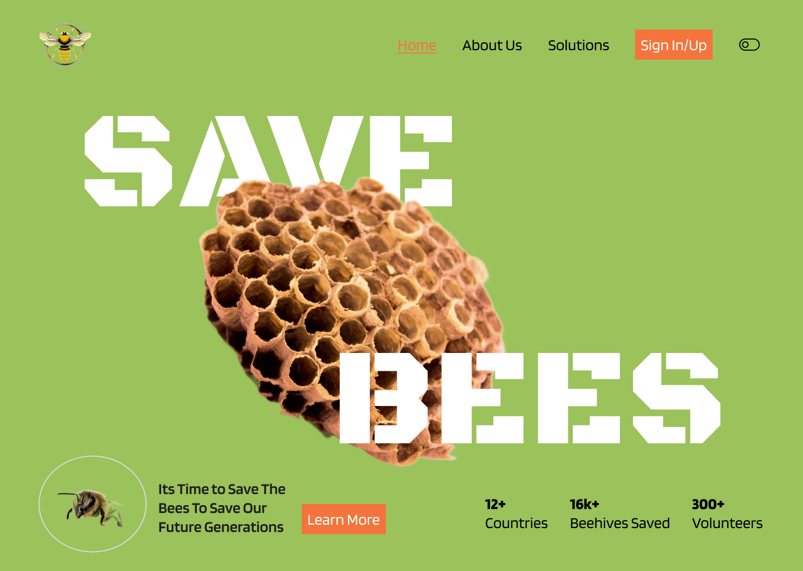
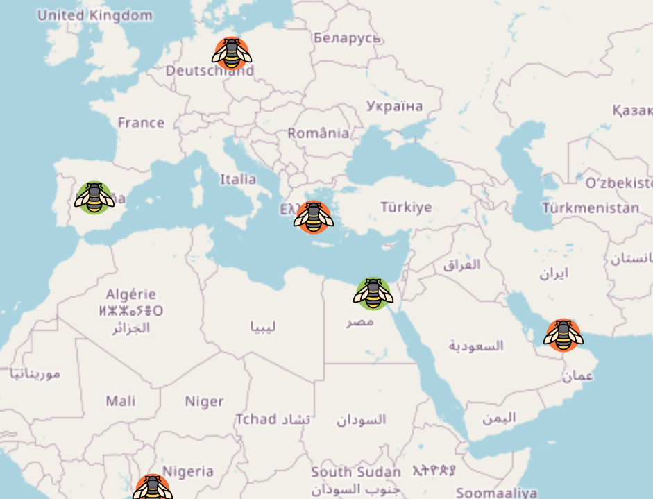

## [**The Bee Saving Project**](https://v50-tier3-team-28.onrender.com/)

It's no secret that the declining bee population is causing an environmental crisis. A future without bees is bleak, but did you know there are things you can do to make a big impact?

Join us in saving wild bees! Our app fosters collaboration, awareness, and a sustainable future for pollinators and our planet.

Every bee counts!

You can view the live site [here](https://v50-tier3-team-28.onrender.com/).


## Table of Contents

- [About](#about)
- [Features](#features)
- [Technologies Used](#technologies-used)
- [Installation](#installation)
- [Sample Credentials](#sample-credentials)
- [Our Team](#our-team)

## About


This Full-Stack MERN app is part of a shared project created by Team 28 for Voyage 50 of the Chingu Program. Chingu is a collaborative platform that brings together developers from around the world. You can learn more about Chingu on their [website](https://www.chingu.io/)


## Features



- Interactive map for reporting bees in need and finding bees to help
- Personalized dashboard for the logged-in user
- Visualizations and insights on bee population decline
- Actionable tips for individual bee rescue
- Resource links and related organizations
- Toggle between Dark Mode and Light Mode

## Technologies Used

**Frontend:**

* [![React][React.js]][React-url] + [![Vite][vitejs]][Vite-url] / [![React Router][react-router]][reactrouter-url]
* [![Redux][redux]][redux-url] Toolkit
* [![TailwindCSS][tailwindcss]][tailwind-url]
- [![Chart.js][chart.js]][chart-url]
- Leaflet API

**Backend:**

- [![NodeJS][node.js]][nodejs-url] / [![Express.js][express.js]][expressjs-url]

**Database:**

* [![MongoDB][MongoDB]][mongo-url] / Mongoose

**Authentication:**

- Auth0 / JWT

**Tools:**

- Postman
- Git & GitHub
- Figma
- Render.com
- Jira board

## API Documentation

For a detailed overview of the API, please refer to the [API Overview](docs/api-overview.md) file.

## Installation

To run the app locally, follow these steps:

1. Clone the repository to your local machine
    ```sh
    git clone https://github.com/chingu-voyages/v50-tier3-team-28.git
    ```
2. Open the terminal and navigate to the project directory
3. Run the command `npm install` to install the necessary dependencies
    ```sh
    npm install
    ```
4. Run the command `npm run dev` to start the development server
    ```sh
    npm run dev
    ```
5. Open your browser and navigate to http://localhost:3003 to view the app

## Sample Credentials

To help you get started, you can use the following sample credentials:

Email Address:  
    ```
        thesavingbeeproject@gmail.com
    ```

Password:  
    ```
    ThesavingbeeProject30.06.2024
    ```

## Our Team

- Valeriy Lysenko: [GitHub](https://github.com/Valeriusdev) / [LinkedIn](https://www.linkedin.com/in/valeriylysenko/)
- Kseniia Riabova: [GitHub](https://github.com/KseniiaRiabova) / [LinkedIn](https://www.linkedin.com/in/kseniia--riabova/)
- Nisha: [GitHub](https://github.com/NishaVijai) / [LinkedIn](https://www.linkedin.com/in/noorunnisha-thamizuddin-319976105/)
- Sharaf Anees: [GitHub](https://github.com/sharafcs50) / [LinkedIn](https://linkedin.com/in/sharafrica)
- Rigo L: [GitHub](https://github.com/r1g023) / [LinkedIn](https://www.linkedin.com/in/rigo0101/)
- Andy Brockmann: [GitHub](https://github.com/PongRVA) / [LinkedIn](https://linkedin.com/in/andybrockmann)
- Deepali Sangole: [GitHub](https://github.com/ss-deep) / [LinkedIn](https://www.linkedin.com/in/deepali-sangole-49b0841b/)
- Corinna Bolon: [GitHub](https://github.com/corinnabolon) / [LinkedIn](https://www.linkedin.com/in/corinna-bolon-690003297/)
- Jennifer Urias: [GitHub](https://github.com/eatwanderexplore) / [LinkedIn](https://www.linkedin.com/in/jennyurias/)
- Shimin Chan: [GitHub](https://github.com/Natkuma01) / [LinkedIn](https://www.linkedin.com/in/natalie-chan-shimin/) 


[React.js]: https://img.shields.io/badge/React-20232A?style=for-the-badge&logo=react&logoColor=61DAFB
[React-url]: https://reactjs.org/
[MongoDB]: https://img.shields.io/badge/MongoDB-%234ea94b.svg?logo=mongodb&logoColor=white
[mongo-url]: https://www.mongodb.com/
[vitejs]: https://img.shields.io/badge/Vite-646CFF?logo=vite&logoColor=fff
[Vite-url]: https://vitejs.dev/
[React-router]: https://img.shields.io/badge/React_Router-CA4245?logo=react-router&logoColor=white
[reactrouter-url]: https://reactrouter.com/en/main
[redux]: https://img.shields.io/badge/Redux-764ABC?logo=redux&logoColor=fff
[redux-url]: https://redux-toolkit.js.org/
[tailwindcss]: https://img.shields.io/badge/Tailwind%20CSS-%2338B2AC.svg?logo=tailwind-css&logoColor=white
[tailwind-url]: https://tailwindcss.com/
[chart.js]: https://img.shields.io/badge/Chart.js-FF6384?logo=chartdotjs&logoColor=fff
[chart-url]: https://www.chartjs.org/
[node.js]: https://img.shields.io/badge/Node.js-6DA55F?logo=node.js&logoColor=white
[nodejs-url]: https://nodejs.org
[express.js]: https://img.shields.io/badge/Express.js-%23404d59.svg?logo=express&logoColor=%2361DAFB
[expressjs-url]: https://expressjs.com/